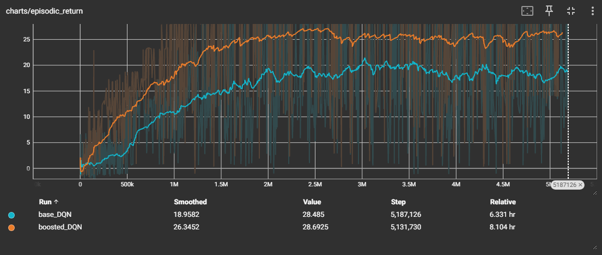

# Super Mario Bros. 3 DQN Tutorial

Train a Deep Q-Network to play **Super Mario Bros. 3**.

This repository is meant to be both a working reinforcement learning project and a learning resource. The code is organized so you can start from a simple environment setup, move into a basic DQN implementation, and then compare it against a stronger version with common DQN upgrades.

This project accompanies my video explanation of DQN, where I walk through the core algorithm step by step.

---

## What This Project Includes

The repository contains three tutorial scripts inside the `tutorial_files/` folder:

```text
tutorial_files/
├── 1_random_play.py
├── 2_basic_DQN.py
└── 3_boosted_DQN.py
```

Each file is intentionally written as a **single-file tutorial**.

That means the code is not split into many modules or abstractions. This is done on purpose for learnability: each file contains the full progression of ideas needed to understand that version of the agent.

---

## Tutorial Files

### `1_random_play.py`

This script introduces the basic environment setup.

It includes:

- Stable-Retro environment creation
- Super Mario Bros. 3 setup
- A custom reward function
- Random action selection
- Video recording

The agent does **not learn** in this file. It simply picks random actions so you can verify that the environment, ROM, reward function, and video recording are working.

Running this script creates:

```text
random_play_videos/
```

---

### `2_basic_DQN.py`

This script contains the main DQN implementation explained in the video.

It includes the core pieces of Deep Q-Learning:

- Neural network Q-function
- Epsilon-greedy action selection
- Replay buffer
- Target network
- TD target calculation
- TD loss
- Frame preprocessing
- Frame stacking
- Training loop
- TensorBoard logging
- Video recording

This version is intentionally kept close to a **basic DQN** so that the algorithm is easier to understand. Even without the extra upgrades, this implementation is sufficient to learn a good Mario policy.

Running this script creates:

```text
base_dqn_mario_runs/
base_dqn_mario_vid/
```

The `base_dqn_mario_runs/` folder contains TensorBoard logs, and `base_dqn_mario_vid/` contains recorded gameplay videos during training.

---

### `3_boosted_DQN.py`

This script builds on the basic DQN implementation and adds several common improvements:

- Dueling DQN
- Double DQN
- Noisy Networks

These upgrades were not covered in detail in the video, but they provide a nice performance boost and are useful if you want to experiment beyond the basic algorithm.

Running this script creates:

```text
boosted_dqn_mario_runs/
boosted_dqn_mario_vid/
```

The `boosted_dqn_mario_runs/` folder contains TensorBoard logs, and `boosted_dqn_mario_vid/` contains recorded gameplay videos.

---

## Pretrained Model

This repository also includes a pretrained model folder.

If you do not want to train from scratch, you can use:

```text
dqn_mario_play.py
```

to load the saved model and watch Mario play using a trained policy.

This is useful if you want to quickly see the final result before digging into the training code.

---

## Installation

### 1. Clone the repository

```bash
git clone https://github.com/ToadAIStation/MarioDQN.git
cd MarioDQN
```

### 2. Create a Python environment

Using conda is recommended:

```bash
conda create -n mario-dqn python=3.10
conda activate mario-dqn
```

### 3. Install requirements

```bash
pip install -r requirements.txt
```

---

## Important: Stable-Retro Setup

This project uses **Stable-Retro**, a maintained fork of OpenAI Retro.

Stable-Retro works best in a **Linux environment**. If you are on Windows, I recommend using **WSL**.

You can install Stable-Retro with:

```bash
pip install stable-retro
```

Depending on your system, you may also need additional Linux packages for video recording and emulator support.

---

## ROM Setup

You must provide your own legally obtained **Super Mario Bros. 3 NES ROM**.

After installing the requirements, import your ROM directory with:

```bash
python -m stable_retro.import /path/to/your/ROMs/directory/
```

For example:

```bash
python -m stable_retro.import ~/ROMs/
```

After this step, Stable-Retro should be able to create the Super Mario Bros. 3 environment.

---

## Running the Code

### Random play demo

```bash
python tutorial_files/1_random_play.py
```

This creates:

```text
random_play_videos/
```

### Train the basic DQN agent

```bash
python tutorial_files/2_basic_DQN.py
```

This creates:

```text
base_dqn_mario_runs/
base_dqn_mario_vid/
```

To view TensorBoard logs:

```bash
tensorboard --logdir base_dqn_mario_runs
```

### Train the boosted DQN agent

```bash
python tutorial_files/3_boosted_DQN.py
```

This creates:

```text
boosted_dqn_mario_runs/
boosted_dqn_mario_vid/
```

To view TensorBoard logs:

```bash
tensorboard --logdir boosted_dqn_mario_runs
```

### Run the pretrained model

```bash
python dqn_mario_play.py
```

This loads the pretrained model and lets you watch Mario play using the learned policy.

---

## Project Structure

```text
.
├── tutorial_files/
│   ├── 1_random_play.py
│   ├── 2_basic_DQN.py
│   └── 3_boosted_DQN.py
│
├── pretrained_model/
│   └── ...
│
├── dqn_mario_play.py
├── requirements.txt
└── README.md
```

Generated folders may include:

```text
random_play_videos/
base_dqn_mario_runs/
base_dqn_mario_vid/
boosted_dqn_mario_runs/
boosted_dqn_mario_vid/
```

---

## Why Single-File Tutorials?

A lot of reinforcement learning codebases are split across many files, which is great for large projects but not always great for learning.

For this repository, I wanted each tutorial script to be readable from top to bottom.

The goal is that you can open one file and see the full story:

1. How the environment is created
2. How observations are processed
3. How actions are selected
4. How rewards are computed
5. How experience is stored
6. How the neural network is trained
7. How gameplay is recorded

This makes the code much easier to learn from.

---

## Basic DQN vs. Boosted DQN

The basic DQN script is the best place to start.

It focuses on the main algorithm:

```text
current Q estimate → TD target → TD error → neural network update
```

The boosted version adds improvements that are common in stronger DQN agents:

| Version | Features | Best For |
|---|---|---|
| Random Play | Environment setup, reward function, random actions | Testing setup |
| Basic DQN | Replay buffer, target network, epsilon-greedy, TD learning | Learning the core algorithm |
| Boosted DQN | Dueling, Double DQN, Noisy Nets | Better performance and experimentation |


### Training Performance

The boosted agent generally learns faster and reaches stronger performance.



If you are new to DQN, I recommend reading `2_basic_DQN.py` first.

---

## Notes

Training reinforcement learning agents can be noisy. Do not be surprised if performance improves unevenly or if some runs are better than others.

A few things that can affect training:

- Random seed
- Exploration schedule
- Reward function
- Number of training steps
- Emulator speed
- GPU/CPU performance
- Video recording frequency

The pretrained model is included so you can still view a successful policy without needing to train for a long time.

---

## Disclaimer

This repository does not include a Super Mario Bros. 3 ROM. You must provide your own legally obtained ROM file.

---

## Credits

This project uses:

- PyTorch
- Stable-Retro
- Gymnasium RL tooling
- TensorBoard

Thanks for checking out the project. I hope it helps make Deep Q-Learning easier to understand.

[Check out the video here](https://www.youtube.com/watch?v=QOFH7ts3IxM).
